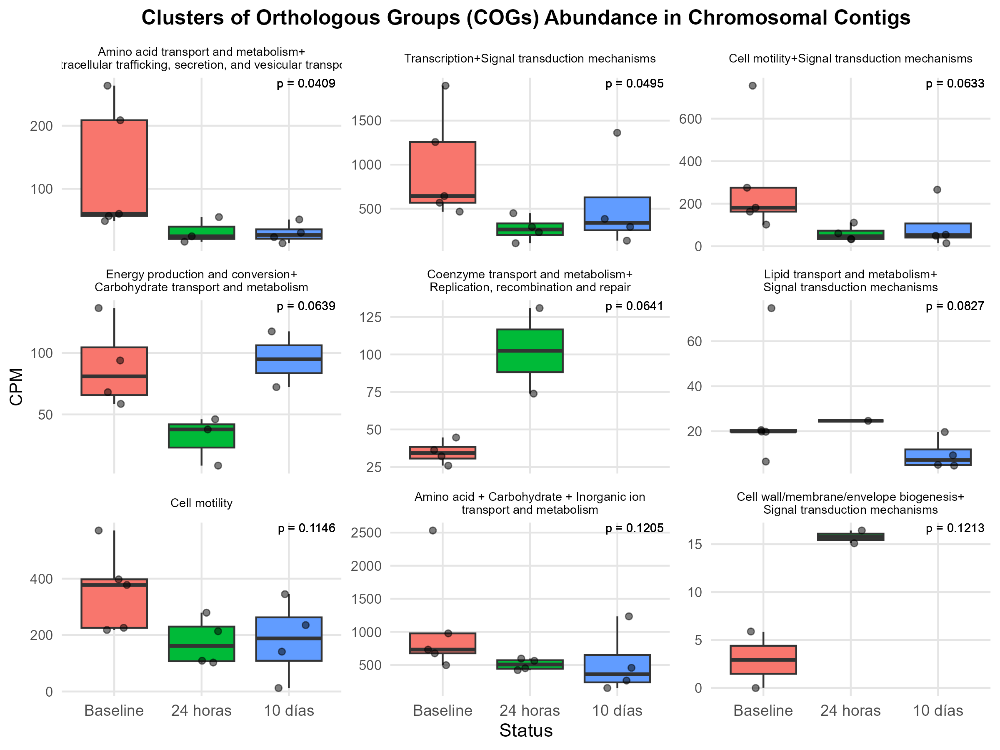
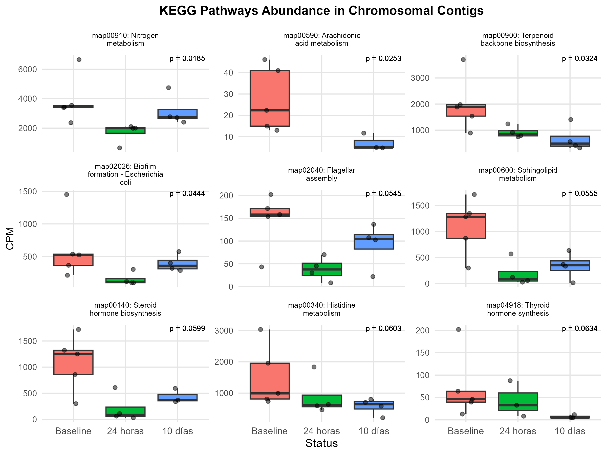
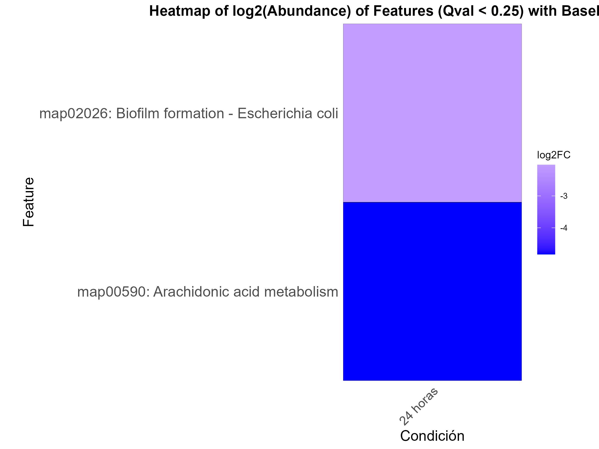
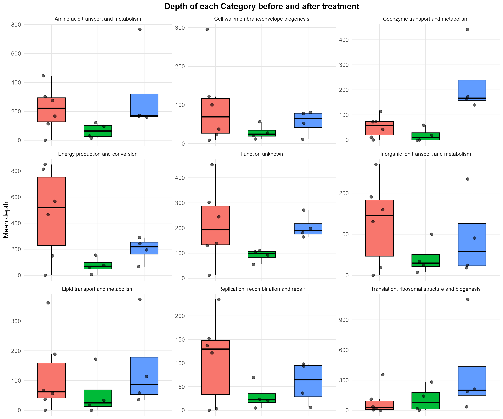
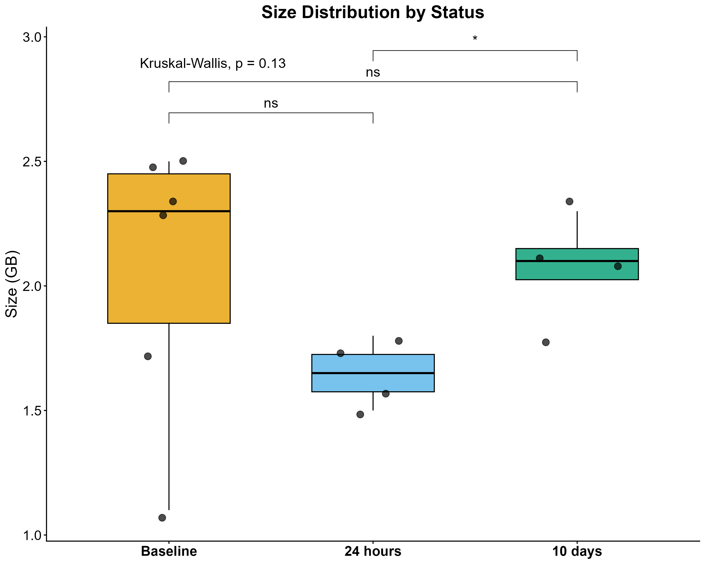
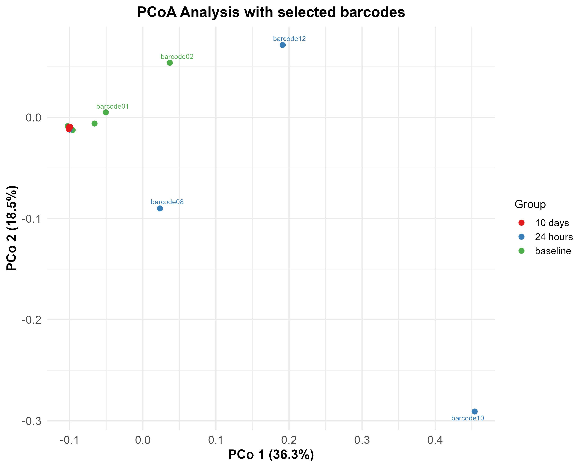
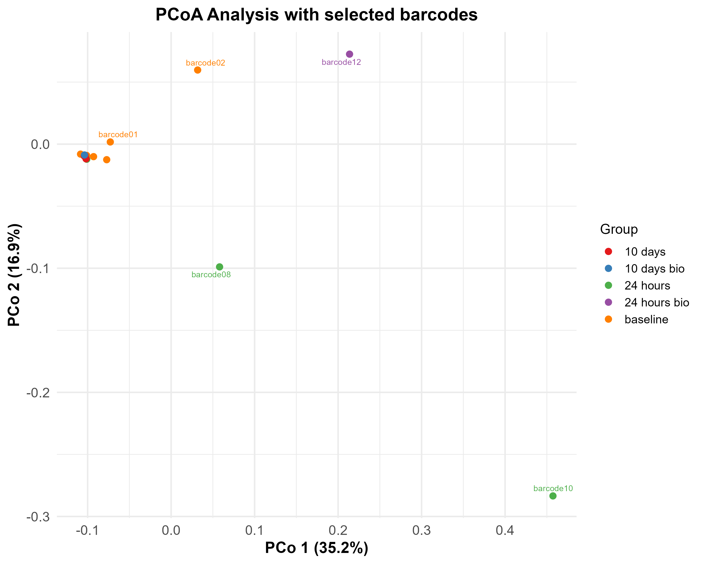

# Soil Microbiome Analysis Repository

This repository gathers multiple exploratory and inferential analyses performed on plasmid, viral, and chromosomal fractions recovered from soil metagenomes. Each folder contains self-contained scripts, intermediate tables, and figures that document the statistical pipelines used to quantify abundance patterns, run differential models, and visualize beta diversity.

## Repository Overview

```
.
├── functional_differential_analysis
│   ├── differential.Rmd
│   ├── results_1.0/
│   └── results_differential_2.0/
├── mosdepth_abundance
│   ├── bar_graphic.R
│   ├── mosdepth_plasmid_genes.sh
│   └── *.png
├── preliminar_analysis_eggnog
│   ├── preliminar_analysis.R
│   ├── *.gff / *.pdf / *.png
└── species_pcoa
    ├── pcoa.R
    ├── relative_abundances_per_sample.txt
    └── *.png
```

The following sections detail the purpose of each directory and script, highlighting the statistical methods that support the generated figures.

## `functional_differential_analysis`

### Purpose
This module performs multi-omics differential abundance modeling on EggNOG-derived annotations (COG, GO, KEGG pathways, BRITE hierarchies, and PFAM domains) using the [MaAsLin2](https://github.com/biobakery/Maaslin2) linear modeling framework. Results are organized into snapshot folders (`results_1.0` and `results_differential_2.0`) that store coefficient tables, residual diagnostics, and curated plots.

### Main Script: [`differential.md`](functional_differential_analysis/differential.md)
- **Data wrangling**: Imports a combined GFF table of features, parses annotation columns, and aggregates read counts per functional category and barcode.
- **Metadata handling**: Harmonizes samples into experimental stages (`baseline`, `24 hours`, `10 days`) to drive fixed-effect contrasts.
- **API-backed annotation**: Queries KEGG, GO (including AmiGO fallbacks), and BRITE APIs to attach descriptive labels, which are later wrapped for readability in plots and heatmaps.
- **Modeling pipeline**: Constructs CPM matrices, runs MaAsLin2 linear models (TSS normalization + log transform), and ranks features with Kruskal–Wallis tests complemented by pairwise Wilcoxon post hoc analyses.
- **Visualization**: Generates faceted boxplots with statistical annotations and, when significant features are detected (q < 0.25), produces log2 fold-change and −log10(q) heatmaps for interpretability.

### Outputs
- **MaAsLin2 folders** contain model fits (`fitted.rds`, `residuals.rds`) and logs for each annotation × origin combination.
- **Boxplot-statistical summaries** (e.g., )) visualize the highest-ranking functional categories across timepoints and genetic structures.






- **Heatmaps** from signficant MaAslin2 results.



## `mosdepth_abundance`

### Purpose
To integrate read-mapping depth information with gene annotations in order to highlight the most abundant plasmid and viral products. The directory also stores finished barplots that summarize top functional hits.

### Script: [`mosdepth_plasmid_genes.sh`](mosdepth_abundance/mosdepth_plasmid_genes.sh)
- Automates the end-to-end coverage annotation workflow: sorts and indexes BAM files, computes per-gene depth using `mosdepth`, and appends depth values back into the original GFF3 feature table.
- Logs each barcode’s processing steps and errors, ensuring reproducibility when rerunning across large cohorts.

### Script: [`bar_graphic.R`](mosdepth_abundance/bar_graphic.R)
- Reads mosdepth-enriched TSVs for plasmids and viruses, filters out hypothetical proteins, and aggregates depth per functional product.
- Selects the top 10 products per barcode and visualizes them via faceted horizontal barplots, enabling rapid comparison of dominant functional signatures.

### Outputs
- [Top plasmid products](mosdepth_abundance/top10_products_plasmids.png) show barcode-specific gene depth rankings.
- [Top viral products](mosdepth_abundance/top10_products_virus.png) mirror the plasmid plots for viral contigs.

## `preliminar_analysis_eggnog`

### Purpose
Provides exploratory statistics for EggNOG annotations prior to differential testing. Also, it transforms depth tables into LEfSe-ready matrices and visualizations that inspect category-level variability.

### Main Script: [`preliminar_analysis.R`](preliminar_analysis_eggnog/preliminar_analysis.R)
- Cleans GFF-derived tables, resolves ambiguous names, and aggregates depth per functional label across barcodes.
- Builds wide matrices with status metadata to feed downstream LEfSe discrimination analyses, ensuring only consistently observed features are retained.
- Constructs preliminary boxplots comparing depth distributions across timepoints for selected COG classes, with optional outlier removal (e.g., excluding `barcode03`).
- Identifies the nine most abundant COG categories (based on median depth) and renders faceted boxplots to profile shifts across experimental stages.

### Outputs
- Captures raw depth trends (not yet normalized) across the top functional classes of COGs.

- Provides the raw depths between each barcode belonging to each group to spot any possible correlation with the raw depth showed by COGs clases.
 
- [Energy production and conversion boxplot](preliminar_analysis_eggnog/boxplot_energy_production_conversion.png) that focuses on raw counts of reads from CDS assigned to this metabolic pathway over time.


## `species_pcoa`

### Purpose
Assesses beta diversity among metagenomic samples via Principal Coordinates Analysis (PCoA) applied to species-level relative abundance tables.

### Main Script: [`pcoa.R`](species_pcoa/pcoa.R)
- Loads taxonomic abundance matrices, filters samples to the barcodes used in co-assemblies, and imposes prevalence/abundance thresholds to remove rare taxa.
- Calculates Bray–Curtis dissimilarities, runs classical multidimensional scaling (`cmdscale`), and reports the variance explained by the first two axes.
- Joins ordination scores with experimental metadata, applying `ggrepel` labeling for readability and exporting publication-ready figures.
- Repeats the analysis on a broader cohort that includes biofilm barcodes, enabling comparison between standard and biofilm conditions.

### Outputs
- PCoA plot to visualize temporal clustering among baseline, 24-hour, and 10-day samples.
 
- PCoA plot with biofilm barcodes that extends the ordination to include additional ecological states.


## Getting Started
While absolute paths in the scripts point to the original analyst’s workstation, reproducibility can be achieved by:
1. Cloning the repository and adjusting `setwd()` statements to match your local project root.
2. Ensuring dependencies are installed: R packages (`tidyverse`, `Maaslin2`, `vegan`, `ggpubr`, `ggrepel`, etc.) and command-line tools (`samtools`, `mosdepth`).
3. Re-running scripts within each folder to regenerate tables and figures as needed.

## Citation
If you use these workflows, please cite the relevant software (MaAsLin2, EggNOG-mapper, mosdepth, vegan) and acknowledge the project contributors.